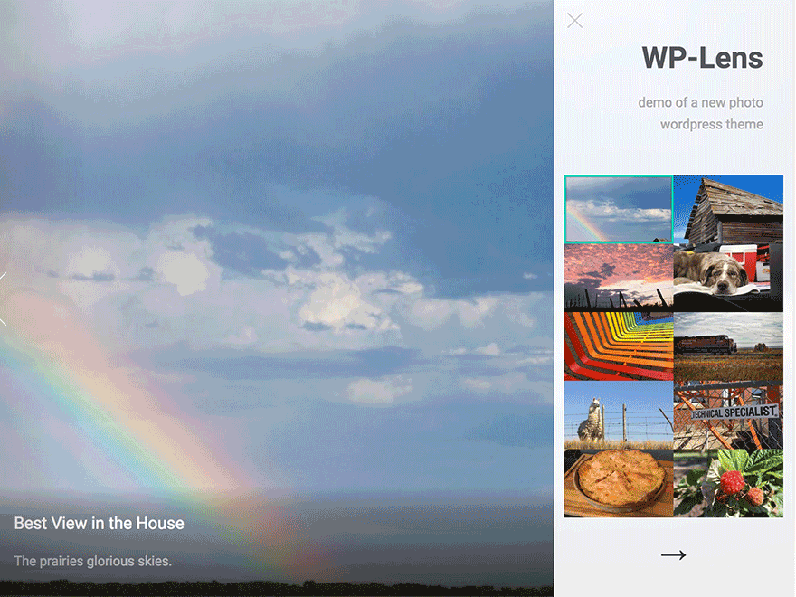
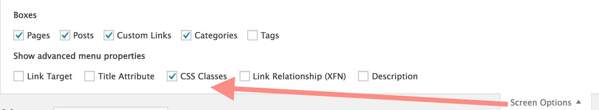

# HTML5 Up Lens Theme for Wordpress

-----
*If this kind of stuff has any value to you, please consider supporting me so I can do more!*

 

----- 

A configurable Wordpress Theme version of [HTML5up Highlights Theme](https://html5up.net/lens) made for the internet by [@cogdog](http://cog.dog). It creates a beautiful way to share and organize photos like this

You can see a demo version at http://lab.cogdogblog.com/lens/

All photos are represented via posts using featured images. Photos can be navigated slide show like from the large buttons or from the right side set of thumbnails.

As a WordPress theme, this site is not limited to the hard coded number of photos in the original template (it adds pagination links), plus they can be organized by category, tag, post date displayed via a widget on the right side.

## Installing from Scratch

Install this theme on any self hosted Wordpress site. No luck on Wordpress.com, get a real web hosting package. 

You should download a ZIP file of this GitHub Repo (that's via the green **Clone or Download*" button above as a file `wp-lens-master.zip`). 

The zip can be uploaded directly to your site via **Add Themes** in the Wordpress dashboard. Of you run into size upload limits or just prefer going old school like me, unzip the package and ftp the entire folder into your `wp-content/themes` directory.

## Updating the Theme

If you have ftp/sftp access to your site (or this can be done in a cpanel file manager), simply upload the new theme files to the `wp-content/themes` directory that includes the older version theme. 

For those that lack direct file upload access or maybe that idea sends shivers down the spine, upload and activate the [Easy Theme and Plugin Upgrades](https://wordpress.org/plugins/easy-theme-and-plugin-upgrades/) plugin -- this will allow you to upload a newer version of a theme as a ZIP archive, the same way you add a theme by uploading.

## Adding Images

Images are merely posts- upload your photos are featured images; they should be all least 1200px wide and 750px wide. Enter the title and a caption up to 100 words in length.

Customize the area below the images by adding widgets.

### Social Media Icons

This theme supports the use of a plugin for adding to the footer a  menu of social media links.

To have a customized set of icon links in the footer, install and activate the [Font Awesome 4 Menus](https://wordpress.org/plugins/font-awesome-4-menus/) plugin. This allows you to add an icon to any menu item.

From the Wordpress Dashboard look under **Appearances** for **Menus**. Click **create a new menu**  name it whatever you like -- `social` is  a good choice. Under  **Menu Settings** next to **Display Location** check the box for `Social Media`. 

To add a social media (or any link), open the panel for **Custom Link**. 

Enter a title for the site and provide the URL that points to your content on that site. Add as many as you like. You can drag and drop them to change the order.

To set the icon, you must first enable the visibility of CSS classes for each menu item.  Click **Screen Options** in the upper right, and check the box for **CSS Classes**.

Open an item in your Social Menu and you will now see a field for entering CSS Class names. You have the choice to add from [well over 400 icons in the Font Awesome collection](http://fontawesome.io/icons/). Find the name of the icon you wish to use, and enter it's name as a CSS class with `fa-` in front. 

For example, these are the class names to render the icon for typical social media sites (these should be all lower case):

* fa-twitter
* fa-facebook
* fa-youtube
* fa-linkedin
* fa-instagram
* fa-flickr

With the Font Awesome icons, you can add any site you wish to be in your footer and pick the icon you prefer.

**Save** your menu and check out the spiffy icons in the footer.

# Update History

* v 0.1 Sept 23, 2018 First version hatched

 

